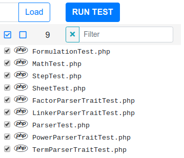
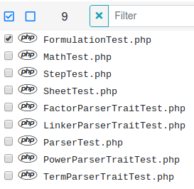
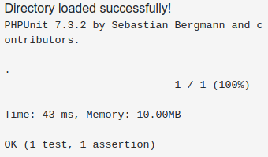
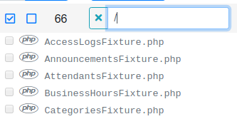
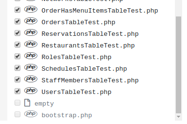
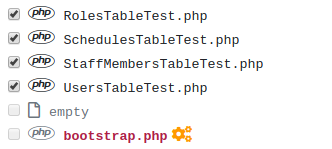

UTUI stands for "unit test user interface".  
As of now, it is a simple interace to get PHPUnit outputs in the browser. Currently, this interface was designed to works with [**`composer`**](https://getcomposer.org/) PHP projects. This means,  

*   Your project's root folder must contain a `composer.json` file.
*   Your project's `vendor/autoload.php` must be properly configured.
*   You're using [**`phpunit`**](https://phpunit.de/) testing framework.

However, if you have your own `autoload.php` file located in `/vendor` from your project's root folder or, you have a `bootstrap` file located in your test folder and provided that you're also using `phpunit`, the interface should still work as it should.

## Setup

### Install

Once you have unzipped the folder, open a terminal, `cd` into the folder and run the following command:  

`composer install`

### Troubleshooting

When using the [`phpunit-server`](https://github.com/crownlessking/phpunit-server), `PHP-CLI` is required. Make sure it is installed properly by doing `php -v` from the command line. the `PHP` version should get printed. If not, download and install it.  
Permission is the only issue I ran into when developing this interface.  
Make sure that `PHP` has enough permission to create folders and files. The app will create ONLY one folder called `tmp` in `phpunit-ui` root folder and two files: `bootstrap.php` and `filesList.xml`.  
If PHP cannot create that folder and these files, the interface will NOT work.  
I personally solved this problem by changing the group settings (ownership) of `phpunit-ui` project folder and all files within.  
Since I am on Linux, assuming that `phpunit-ui-master` is the unzipped folder name, I used the following command:  

`chown -R :www-data phpunit-ui-master`  

When I changed the group to `www-data` the problem was gone. Naturally, PHP should be in the www-data group. If you still get permission issues, try deleting the `tmp` folder.

### Troubleshooting GitHub Downloads

On linux, after downloading `phpunit-ui` from GitHub, the permissions might be all messed up.  
If that is the case, once you have unzipped the `phpunit-ui` folder, open a terminal and run the following command on the newly unzipped folder:  

`sudo chown -R :www-data phpunit-ui-master`  

and then  

`chmod -R a+rX phpunit-ui-master`  

and finally,  

`chmod -R g+w phpunit-ui-master`  

This should give PHP enough permission to create folders.

### Case of missing `phpunit.phar`

If you are using the `phpunit-server` with this interface,  
you first need to download the `PHAR` version of `phpunit`. Once that is done, rename the downloaded file to `phpunit`, with no extension. Then copy-paste it in the root folder of `phpunit-ui`, next to the `index.php` file.

### Updating `phpunit.phar`

It is the same procedure if you want to update `phpunit.phar`.  
Just overwrite the existing one with the newer version.

**Note:** This interface was implemented using `phpunit.phar version 7.3.x`.

## How to Use

Click on the  icon on the navigation bar to bring up the unit-test interface. Once you're on the uni-test interface, you must select the project on which you want to conduct tests.

### Select Your Project's Root Folder

To do that, click on  to enter the path to your project's root folder.

Once you have entered your project's root folder path and it is correct, if your PHP test files are located the `tests` folder, they will be automatically loaded after clicking the  button. If they are not located in the `tests` folder, you can use the `textfield` to specify your custom folder. e.g.  

### Load Test Files

Once your project's root and tests folder are correct, after clicking the  button, all your PHP test files, including those located in sub-folders will populate the files list pane.

e.g.  

### Running Tests

Once the test files are loaded, click on the  button to run unit tests.

To test a single file, uncheck all files by clicking the blank square, without a check mark:  and check only the file you want to test.  
  
Then click on the  button.

Results are displayed on the left in the output pane. Notice, these are phpunit console outputs:  

### Adding Bootstrap File(s)

To boostrap a file, a file which needs to run before the test begins, it must first be located in your project test folder. It won't be visible since its not a test file. To view other files in your project directory, in the filter textfield, type "`/`" without the quotes.

The files will be grey-out and you will not be able to check them like a test file. But if the file is a PHP file, you will be able to bootstrap it. e.g.

If you hover the file name with your mouse pointer, a "cogs" icon will appear and you'll be able to click on it.

Once you do that, the `bootstrap.php` file will now be bootstrapped when you click the  to run your test.

## Additional Information

### Source code

web interface: [https://github.com/crownlessking/utui](https://github.com/crownlessking/utui)  
phpunit server: [https://github.com/crownlessking/phpunit-server](https://github.com/crownlessking/phpunit-server)
